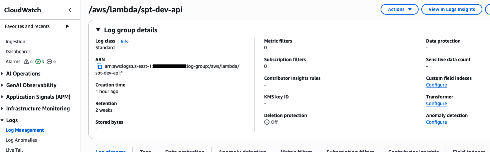
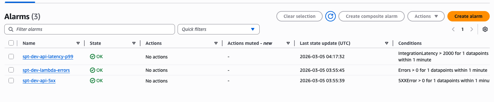

# Serverless Platform Template (AWS)

A minimal, production-shaped serverless API on AWS using Terraform and Python 3.12. Designed to stay under $5/month at low traffic when deployed with the included guardrails.

## What it is

- **API Gateway HTTP API** — routes: `GET /health`, `POST /items`, `GET /items/{id}`
- **Lambda** — Python 3.12, 128 MB, 10s timeout
- **DynamoDB** — on-demand billing, SSE enabled
- **CloudWatch** — log retention 14 days, Lambda errors alarm, API GW 5XX + latency alarms
- **Budgets** — $5/month alert (set your email before apply)
- **Cognito** (optional) — JWT auth toggle via `var.enable_cognito`

## Quick start

### 1. Bootstrap the backend

```bash
bash scripts/bootstrap_backend.sh
# Copy the printed values into infra/envs/dev/backend.hcl
```

### 2. Set your email (gitignored)

```bash
cat > infra/envs/dev/dev.auto.tfvars <<EOF
budget_alert_email = "your-email@example.com"
EOF
```

### 3. Deploy

```bash
cd infra/envs/dev
terraform init -backend-config=backend.hcl -reconfigure
terraform plan -out=tfplan
terraform apply tfplan
```

### 4. Smoke test

```bash
# Run from repo root — auto-fetches the API URL from Terraform output
bash scripts/smoke_test.sh
```

### 5. Destroy

```bash
cd infra/envs/dev
terraform destroy
```

## Outputs

- `api_base_url` — base URL of the deployed API (e.g. `https://abc123.execute-api.us-east-1.amazonaws.com`)
- `lambda_function_name` — name of the Lambda function
- `lambda_log_group` — CloudWatch log group path
- `dynamodb_table_name` — DynamoDB table name

## 5-minute demo

After deploy, the API is live immediately. Real output from a working deployment.

> `jq` is used for pretty-printing below — remove `| jq .` if you don't have it installed.

```bash
cd infra/envs/dev
API_URL=$(terraform output -raw api_base_url)

# 1) Health
curl -sS "$API_URL/health" | jq .
```
```json
{
  "status": "ok"
}
```

```bash
# 2) Create an item
ID="item-$(date +%s)"
curl -sS -X POST "$API_URL/items" \
  -H "Content-Type: application/json" \
  -H "X-Correlation-Id: demo-123" \
  -d "{\"id\":\"$ID\",\"name\":\"demo\"}" | jq .
```
```json
{
  "id": "item-<timestamp>"
}
```

```bash
# 3) Read it back
curl -sS "$API_URL/items/$ID" | jq .
```
```json
{
  "id": "item-<timestamp>",
  "name": "demo"
}
```

Or run the full smoke test in one command (from repo root):

```bash
bash scripts/smoke_test.sh
# Smoke test passed.
```

## Cost guardrails

- DynamoDB: PAY_PER_REQUEST (no idle cost)
- Lambda: outside VPC (no NAT Gateway)
- No provisioned concurrency
- CloudWatch logs: 14-day retention on all log groups
- $5/month budget alert — **set `budget_alert_email` before apply**

## Enabling Cognito auth

Add to `infra/envs/dev/dev.auto.tfvars`:

```hcl
enable_cognito = true
```

Then re-plan and apply:

```bash
terraform plan -out=tfplan && terraform apply tfplan
```

When enabled, `POST /items` and `GET /items/{id}` require a valid Cognito JWT in the `Authorization` header. `GET /health` remains public.

```bash
# Get a token (after creating a test user — see docs/cognito.md)
TOKEN=$(aws cognito-idp initiate-auth \
  --auth-flow USER_PASSWORD_AUTH \
  --client-id <client_id> \
  --auth-parameters USERNAME=testuser,PASSWORD="TestPass1!" \
  --region us-east-1 \
  --query "AuthenticationResult.IdToken" \
  --output text)

curl -sS "$API_URL/items/abc" \
  -H "Authorization: Bearer $TOKEN" | jq .
```

See [docs/cognito.md](docs/cognito.md) for the full setup guide.

## Extending

- Add routes: extend `handler.py` and add `aws_apigatewayv2_route` resources in `modules/apigw_http_api/main.tf`
- Add DynamoDB attributes: update `modules/dynamodb_table/main.tf` and the IAM policy in `modules/iam/main.tf`
- Add environments: copy `infra/envs/dev/` to `infra/envs/prod/` and update the backend key

## Deployment proof

CloudWatch log retention configured:



CloudWatch alarms configured:



## More detail

See [docs/runbook.md](docs/runbook.md) for deploy, test, destroy, and troubleshooting steps.
